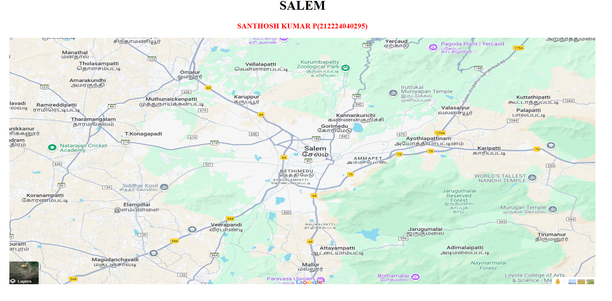
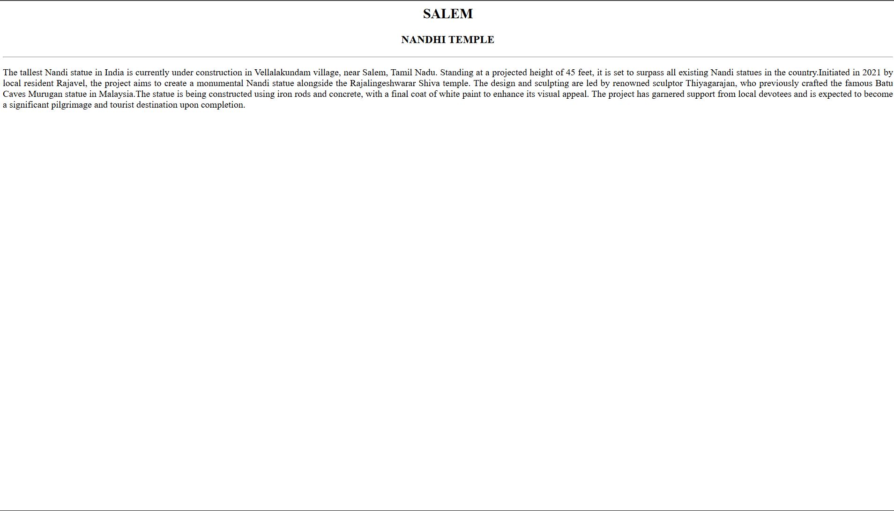
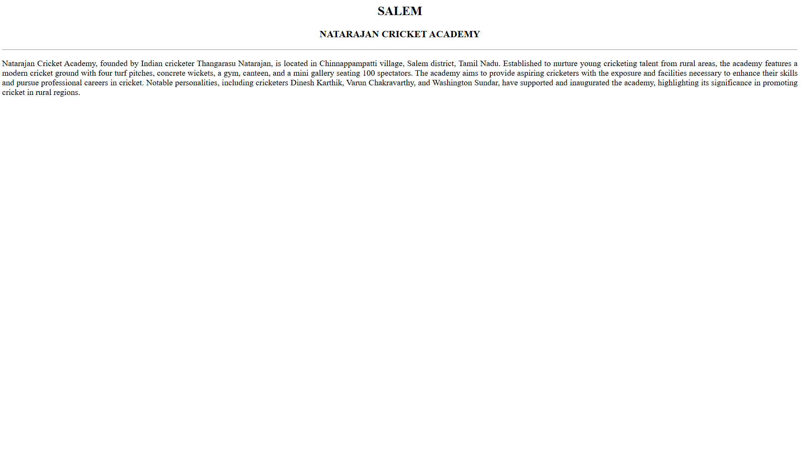
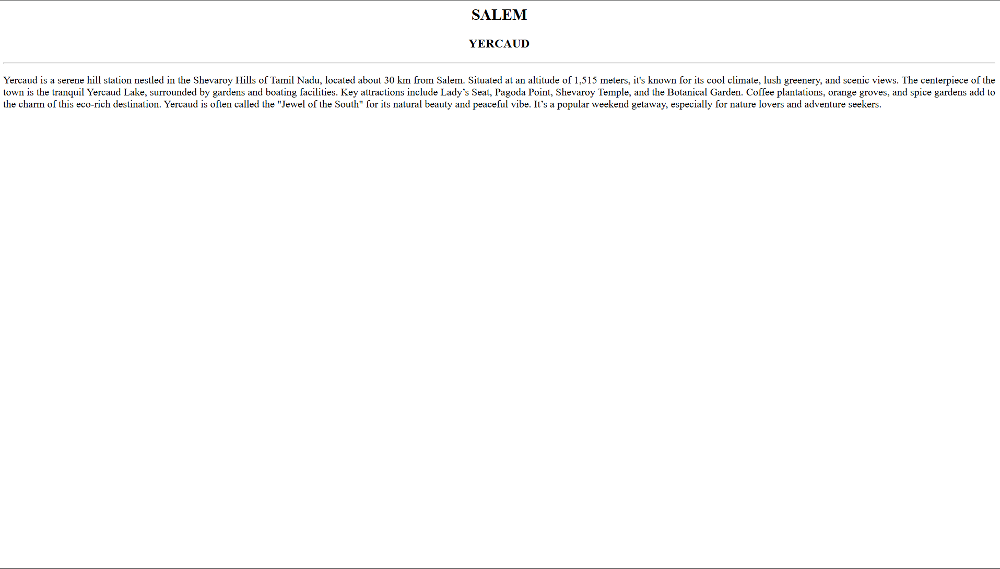
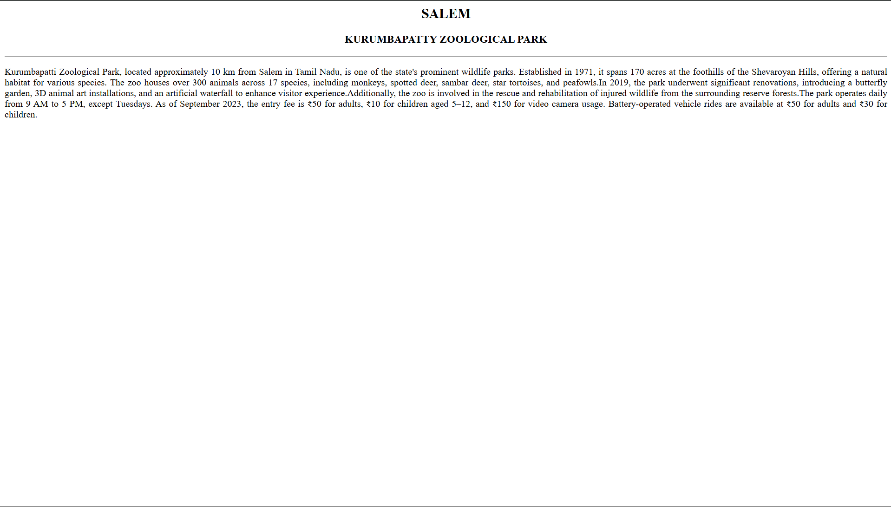
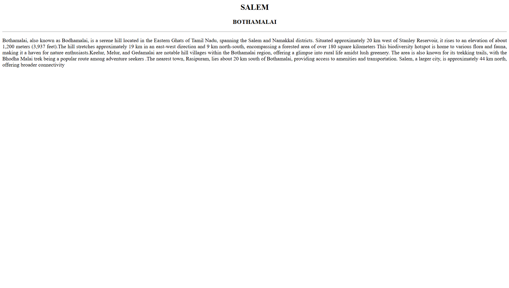

# Ex04 Places Around Me
# Date:22/04/2025
# Reg No:212224040295
# AIM
To develop a website to display details about the places around my house.

# DESIGN STEPS
## STEP 1
Create a Django admin interface.

## STEP 2
Download your city map from Google.

## STEP 3
Using <map> tag name the map.

## STEP 4
Create clickable regions in the image using <area> tag.

## STEP 5
Write HTML programs for all the regions identified.

## STEP 6
Execute the programs and publish them.

# CODE
```
map.html
<html>
    <head>
       <title>MY CITY</title>
    </head>
    <body>
        <h1 align="center">
            <font color="black"><b>SALEM</b></font>
        </h1>
        <h3 align="center">
        <font color="red"><b>SANTHOSH KUMAR P(212224040295)</b></font>
        </h3>
        <CENTER>
            
            <map name="MyCity">
            <area shape="rect" coords="1342,519,1558,578" href="temple.html" title="NANDHI TEMPLE">
            <area shape="rect" coords="100,396,300,450" href="natarajan.html" title="NATARAJAN CRICKET ACADEMY">
            <area shape="rect" coords="1074,3,1178,46" href="yercaud.html" alt="college" title="YERCAUD">
            <area shape="rect" coords="831,78,1009,156" href="kurumbapatty.html" title="KURUMBAPATTY ZOOLOGICAL PARK">
            <area shape="rect" coords="1061,906,1229,954" href="bothamalai.html" title="BOTHAMALAI">
    
            </map>
        </CENTER>
    </body>
</html>

temple.html

<html>
    <BODY bgcolor="white">
    <h2 align="center"><font color="black">SALEM</h2></FONT>
    <H3 align="center">NANDHI TEMPLE</H3>
    <HR>
    <p align="justify">The tallest Nandi statue in India is currently under construction in Vellalakundam village, near Salem, Tamil Nadu. Standing at a projected height of 45 feet, it is set to surpass all existing Nandi statues in the country.​Initiated in 2021 by local resident Rajavel, the project aims to create a monumental Nandi statue alongside the Rajalingeshwarar Shiva temple. The design and sculpting are led by renowned sculptor Thiyagarajan, who previously crafted the famous Batu Caves Murugan statue in Malaysia.The statue is being constructed using iron rods and concrete, with a final coat of white paint to enhance its visual appeal. The project has garnered support from local devotees and is expected to become a significant pilgrimage and tourist destination upon completion.</p>
</BODY>
</html>

natarajan.html

<html>
    <BODY bgcolor="white">
    <h2 align="center"><font color="black">SALEM</h2></FONT>
    <H3 align="center">NATARAJAN CRICKET ACADEMY</H3>
    <HR>
    <p align="justify">Natarajan Cricket Academy, founded by Indian cricketer Thangarasu Natarajan, is located in Chinnappampatti village, Salem district, Tamil Nadu. Established to nurture young cricketing talent from rural areas, the academy features a modern cricket ground with four turf pitches, concrete wickets, a gym, canteen, and a mini gallery seating 100 spectators. The academy aims to provide aspiring cricketers with the exposure and facilities necessary to enhance their skills and pursue professional careers in cricket. Notable personalities, including cricketers Dinesh Karthik, Varun Chakravarthy, and Washington Sundar, have supported and inaugurated the academy, highlighting its significance in promoting cricket in rural regions. </p>
</BODY>
</html>

yercaud.html

<html>
    <BODY bgcolor="white">
    <h2 align="center"><font color="black">SALEM</h2></FONT>
    <H3 align="center">YERCAUD</H3>
    <HR>
    <p align="justify">Yercaud is a serene hill station nestled in the Shevaroy Hills of Tamil Nadu, located about 30 km from Salem.
        Situated at an altitude of 1,515 meters, it's known for its cool climate, lush greenery, and scenic views.
        The centerpiece of the town is the tranquil Yercaud Lake, surrounded by gardens and boating facilities.
        Key attractions include Lady’s Seat, Pagoda Point, Shevaroy Temple, and the Botanical Garden.
        Coffee plantations, orange groves, and spice gardens add to the charm of this eco-rich destination.
        Yercaud is often called the "Jewel of the South" for its natural beauty and peaceful vibe.
        It’s a popular weekend getaway, especially for nature lovers and adventure seekers.</p>
</BODY>
</html>

kurumbapatty.html

<html>
    <BODY bgcolor="white">
    <h2 align="center"><font color="black">SALEM</h2></FONT>
    <H3 align="center">KURUMBAPATTY ZOOLOGICAL PARK</H3>
    <HR>
    <p align="justify">Kurumbapatti Zoological Park, located approximately 10 km from Salem in Tamil Nadu, is one of the state's prominent wildlife parks. Established in 1971, it spans 170 acres at the foothills of the Shevaroyan Hills, offering a natural habitat for various species. The zoo houses over 300 animals across 17 species, including monkeys, spotted deer, sambar deer, star tortoises, and peafowls.In 2019, the park underwent significant renovations, introducing a butterfly garden, 3D animal art installations, and an artificial waterfall to enhance visitor experience.Additionally, the zoo is involved in the rescue and rehabilitation of injured wildlife from the surrounding reserve forests.The park operates daily from 9 AM to 5 PM, except Tuesdays. As of September 2023, the entry fee is ₹50 for adults, ₹10 for children aged 5–12, and ₹150 for video camera usage. Battery-operated vehicle rides are available at ₹50 for adults and ₹30 for children.</p>
</BODY>
</html>

bothamalai.html

<html>
    <BODY bgcolor="white">
    <h2 align="center"><font color="black">SALEM</h2></FONT>
    <H3 align="center">BOTHAMALAI</H3>
    <HR>
    <p align="justify">Bothamalai, also known as Bodhamalai, is a serene hill located in the Eastern Ghats of Tamil Nadu, spanning the Salem and Namakkal districts. Situated approximately 20 km west of Stanley Reservoir, it rises to an elevation of about 1,200 meters (3,937 feet).The hill stretches approximately 19 km in an east-west direction and 9 km north-south, encompassing a forested area of over 180 square kilometers This biodiversity hotspot is home to various flora and fauna, making it a haven for nature enthusiasts.​Keelur, Melur, and Gedamalai are notable hill villages within the Bothamalai region, offering a glimpse into rural life amidst lush greenery. The area is also known for its trekking trails, with the Bhodha Malai trek being a popular route among adventure seekers .The nearest town, Rasipuram, lies about 20 km south of Bothamalai, providing access to amenities and transportation. Salem, a larger city, is approximately 44 km north, offering broader connectivity</p>
</BODY>
</html>

```
# OUTPUT








# RESULT
The program for implementing image maps using HTML is executed successfully.
